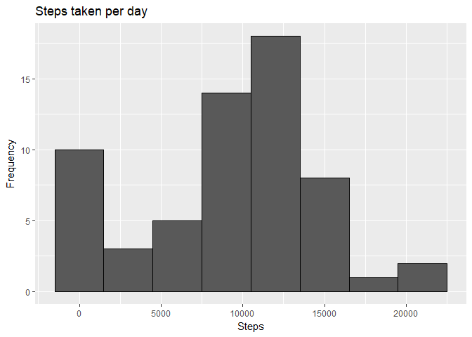
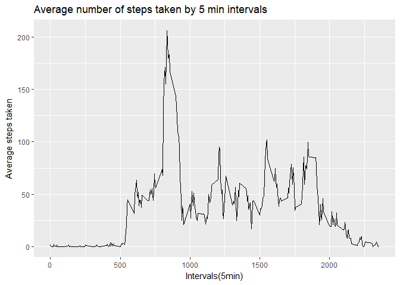
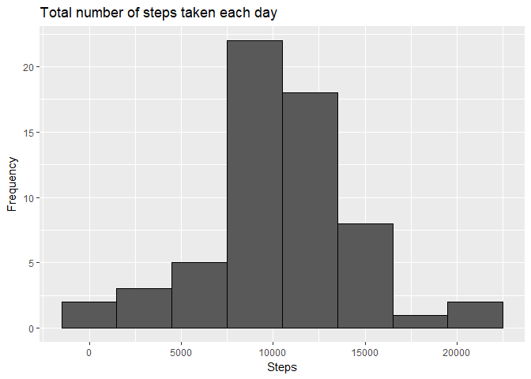
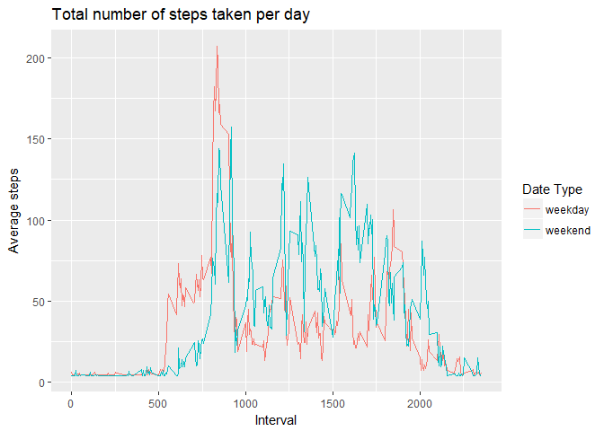

# Reproducible Research: Peer Assessment 1

knitr::opts_chunk$set(echo = TRUE)

## Library useful packages

```r
library(ggplot2)
library(tidyverse)
```

```
## Warning: package 'tidyverse' was built under R version 3.4.2
```

```
## Loading tidyverse: tibble
## Loading tidyverse: tidyr
## Loading tidyverse: readr
## Loading tidyverse: purrr
## Loading tidyverse: dplyr
```

```
## Conflicts with tidy packages ----------------------------------------------
```

```
## filter(): dplyr, stats
## lag():    dplyr, stats
```

## Loading and preprocessing the data

```r
activity <- read.table(unz("activity.zip", "activity.csv"), header = TRUE, sep=",", stringsAsFactors = FALSE)
```


## What is mean total number of steps taken per day?
1. Calculate total number of steps 

```r
StepsByday <- activity %>% group_by(date) %>% summarise(total = sum(steps, na.rm = TRUE))
```

2. Make the Histogram for total number of steps taken per da  y

```r
g <- ggplot(StepsByday, aes(x = total))
g + geom_histogram(binwidth = 3000, colour = "#000000") + labs(title = "Steps taken per day", x = "Steps", y = "Frequency")
```

<!-- -->

3. Calculate the mean total number of steps taken per day

```r
mean_steps <- mean(StepsByday$total)
median_steps <- median(StepsByday$total)
mean_steps
```

```
## [1] 9354.23
```

```r
median_steps
```

```
## [1] 10395
```

## What is the average daily activity pattern?
1.Time series plot of the average number of steps taken

```r
StepsByIntervals <- activity %>% group_by(interval) %>% summarise(mean = mean(steps, na.rm = TRUE))
g <- ggplot(StepsByIntervals, aes(x = interval, y = mean))
g + geom_line() + labs(title = "Average number of steps taken by 5 min intervals", x = "Intervals(5min)", y = "Average steps taken")
```

<!-- -->

2.The 5-minute interval that, on average, contains the maximum number of steps

```r
maxsteps <- StepsByIntervals[which.max(StepsByIntervals$mean),1]
maxsteps
```

```
## # A tibble: 1 x 1
##   interval
##      <int>
## 1      835
```

## Imputing missing values
1.  Calculate and report the total number of missing values in the dataset 

```r
sum(is.na(activity$steps))
```

```
## [1] 2304
```

2.Impute missing value, using daily average steps divided by total intervals per day.

```r
activity_new <- activity
activity_new$steps[is.na(activity_new$steps)] <-mean_steps/288 
```

3.Histogram of the total number of steps taken each day after missing values are imputed

```r
StepsByday_r <- activity_new %>% group_by(date) %>% summarise(total = sum(steps)) 
g <- ggplot(StepsByday_r, aes(total))
g + geom_histogram(binwidth = 3000, colour = "#000000") + labs(title = "Total number of steps taken each day", x = "Steps", y = "Frequency") 
```

<!-- -->
4. Calculate the Mean and Median after imputing missing value

```r
mean_steps <- mean(StepsByday$total)
median_steps <- median(StepsByday$total)
mean_steps
```

```
## [1] 9354.23
```

```r
median_steps
```

```
## [1] 10395
```
## Are there differences in activity patterns between weekdays and weekends?
1. Define weekdays and weekends

```r
activity_new$dateType <-  ifelse(as.POSIXlt(activity_new$date)$wday %in% c(0,6), 'weekend', 'weekday')
```

2. Histogram


```r
activity_weekcom <- activity_new %>% group_by(interval, dateType) %>% summarise(mean = mean(steps))
g <- ggplot(activity_weekcom, aes(interval, mean))
g + geom_line(aes(col = dateType)) + labs(title = "Total number of steps taken per day", x = "Interval", y = "Average steps") + scale_colour_discrete(name  = "Date Type")
```

<!-- -->
